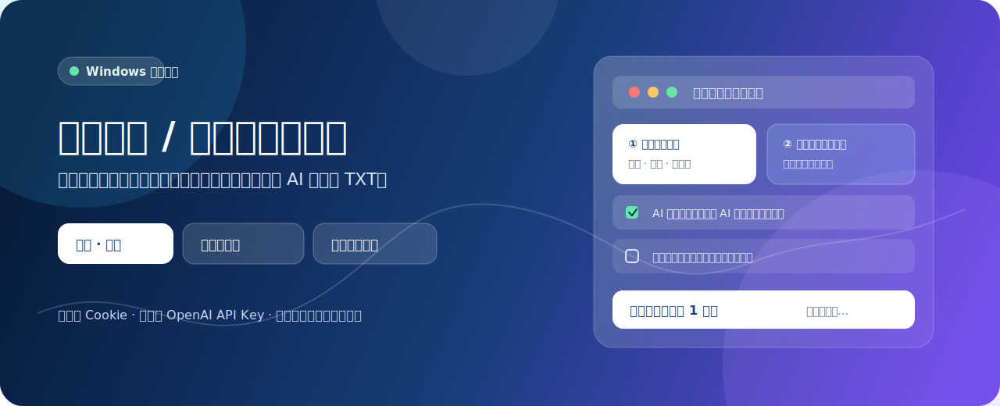
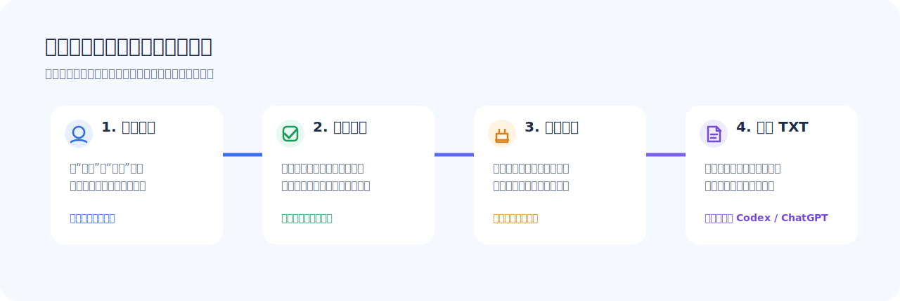
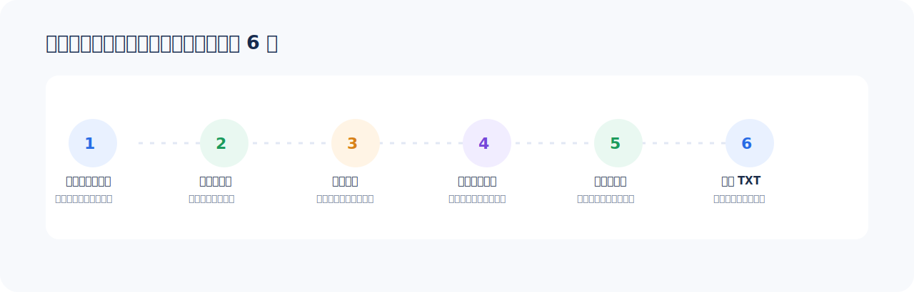

# 抖音喜欢 / 收藏视频转文字

<p align="center">
  
</p>

<p align="center">
  <strong>先筛选，再临时下载并本机转写。</strong><br />
  把自己想回看的抖音视频，整理成可以继续阅读、检索和总结的 TXT。
</p>

<p align="center">
  <a href="LICENSE"></a>
  
  
  
</p>

> **这是一个 Windows 本机桌面工具。** 它不会替你自动点赞、评论或发布内容；只用于读取你有权访问的“喜欢 / 收藏”清单，按你的选择将视频语音转写为文本。使用前请遵守抖音及相关服务的规则，并只处理你有权处理的内容。

---

## 一眼看懂：它能帮你做什么？

| 你遇到的情况 | 这个工具怎么做 |
| --- | --- |
| 喜欢里存了很多视频，想先挑一挑 | 输入数量，先读取**标题、作者、简介和链接**；这一步不下载视频。 |
| 收藏夹里有学习、工作、旅行素材 | 抓取收藏清单，按关键词筛选、全选、反选或逐条勾选。 |
| 只想处理朋友发来的某一条视频 | 直接粘贴整段抖音分享文案；工具会从中提取有效的视频链接。 |
| 不希望视频一直占电脑空间 | 只对已勾选条目临时下载；成功转写后自动清理原视频和下载元数据。 |
| 想把内容继续交给 AI 整理 | 生成 `标题 + 视频链接 + 转写文字` 的 TXT，可上传到 Codex / ChatGPT 继续总结。 |

<p align="center">
  
</p>

---

## 功能总览

### ① 先抓清单，不急着下载

- **抓取喜欢视频**：按你填的数量读取“喜欢”列表中的标题、作者、简介和链接。
- **抓取收藏视频**：读取收藏夹中的视频清单，先展示再选择。
- **自定义数量**：可填写 `50`、`100`、`1000` 等数量；数量越大，读取时间通常越长。
- **重复保护**：已经成功转写、且本地存在有效文字记录的条目会被识别为已处理，避免重复转写。

### ② 自己选择要转的内容

- 支持**逐条勾选、全选、取消全选、反选、清空列表**。
- 支持按标题、作者、来源、简介或链接筛选。
- 可以查看单条详情后再决定是否加入处理队列。
- 只有你勾选的视频才进入下载和转写流程。

### ③ 识别单条抖音分享文案

复制的内容不必是“纯链接”。例如下面这一整段也可以直接粘贴：

```text
4.69 uFH:/ :3pm 09/18 b@a.aa 17 岁高中生创业做 AI……
https://v.douyin.com/6JeDh2x0p8M/ 复制此链接，打开抖音搜索，直接观看视频！
```

工具会尝试从文字中提取其中有效的 `v.douyin.com` 或 `douyin.com` 视频链接，再加入待处理列表。

### ④ 本机临时转写 + 可见进度

- 桌面窗口会显示当前阶段，例如：正在下载第几条、正在转写第几条、正在写入 TXT。
- 视频和下载元数据只在本机工作目录中临时存在。
- **成功处理后自动清理临时媒体**，避免视频文件持续累积占用空间。
- 若下载失败、没有音轨或转写为空，会给出明确状态，不把空白条目误记成成功。

### ⑤ 输出给你，而不是替你上传

默认会生成：

```text
output/待Codex总结.txt
```

每条内容包含：

```text
标题：……
链接：https://www.douyin.com/video/……
来源：喜欢 / 收藏 / 单条链接
转写：……
```

本项目**不需要 OpenAI API Key**。如果你希望 AI 继续做摘要、分类、提炼观点或生成笔记，只要把这个 TXT 上传到 Codex 或 ChatGPT，并告诉它你想要的格式即可。

---

## 3 分钟理解完整流程

<p align="center">
  
</p>

1. **首次初始化一次**：准备 Python 依赖、下载器依赖和浏览器组件。
2. **之后双击启动**：双击 `launch-desktop-app.vbs`，只会打开一个桌面窗口，不需要每次敲命令。
3. **完成登录**：第一次使用或登录失效时，在应用中点击“重新登录抖音”，按浏览器提示扫码/登录。
4. **读取视频清单**：填写数量，点击“抓取喜欢”或“抓取收藏”；也可以粘贴单条分享文本。
5. **勾选后转写**：确认要处理的视频，点击“转为文字（已选 N 条）”，在窗口内查看进度。
6. **打开 TXT**：处理结束后点击“打开待 Codex 总结文本”，可直接阅读或继续交给 AI 总结。

---

## 给第一次使用的小白：从下载到启动

> 当前仓库提供的是**源码版**，不是免安装 `.exe` 安装包。你只需要完成一次初始化；初始化成功后，日常使用就是双击启动桌面工具。

### 0. 你需要准备什么？

- Windows 10 或 Windows 11
- 可正常访问抖音的网络
- 已安装 [Git for Windows](https://git-scm.com/download/win) 和 [uv](https://docs.astral.sh/uv/)
- 至少留出一些磁盘空间：首次运行会下载浏览器组件与本地语音模型；视频本身不会长期累积

> `uv` 是 Python 依赖安装工具。它只在第一次初始化和更新依赖时使用；日常打开软件不需要你理解它。

### 1. 获取项目文件

**方式 A：下载 ZIP（更适合不熟悉 Git 的用户）**

1. 打开本仓库主页，点击绿色的 **Code**。
2. 选择 **Download ZIP**，解压到一个你容易找到的目录，例如 `D:\AI\douyin-likes-to-text`。
3. 不建议解压到 OneDrive 同步目录、U 盘或权限受限的系统目录。

**方式 B：使用 Git 克隆（适合熟悉 Git 的用户）**

```powershell
git clone https://github.com/BigQ749/douyin-likes-to-text.git D:\AI\douyin-likes-to-text
cd D:\AI\douyin-likes-to-text
```

### 2. 只做一次：初始化环境

在项目文件夹的空白处按住 `Shift` 并右键，选择“在终端中打开”或“在此处打开 PowerShell”，然后依次执行：

```powershell
Set-ExecutionPolicy -Scope Process Bypass
.\scripts\bootstrap.ps1
```

初始化会自动完成：

- 安装桌面工具需要的 Python 依赖；
- 下载开源下载器依赖到本机 `.deps/`；
- 下载首次登录要用的浏览器组件；
- 从样例创建只属于你本机的 `config.yml`。

看到 **`Setup complete`** 后，首次准备完成。下载浏览器组件或语音模型时网络波动会导致时间变长；保持窗口打开，完成后再继续。

### 3. 日常启动（以后通常只要这一步）

双击项目根目录下的：

```text
launch-desktop-app.vbs
```

你也可以右键该文件 → **发送到** → **桌面快捷方式**，以后从桌面双击打开。

### 4. 首次登录抖音

1. 打开桌面工具后，右上角会显示“已登录”或“未登录”。
2. 显示“未登录”时，点击 **重新登录抖音**。
3. 在弹出的浏览器窗口内完成抖音登录；成功回到抖音页面后，按窗口提示确认。
4. 返回桌面工具，状态变为“已登录”后再抓取视频。

**为什么有时需要重新扫码？**

登录 Cookie 保存在你的本机，正常情况下可复用；但它也可能因为抖音的安全策略、主动退出、账号状态变化、浏览器登录失效等原因而失效。抓取提示 Cookie 无效时，重新登录即可。请不要分享或上传 `cookies.json`。

---

## 三种常用场景

### 场景 A：整理最近喜欢的学习视频

1. 数量填 `50`。
2. 点击 **抓取喜欢**。
3. 在列表中输入关键词，例如“AI”“英语”“健身”。
4. 勾选想保留的条目。
5. 点击 **转为文字**。
6. 完成后打开 `output/待Codex总结.txt`。

### 场景 B：从收藏夹做专题资料库

1. 输入想读取的数量，例如 `200`。
2. 点击 **抓取收藏**。
3. 按作者、标题或简介筛选，然后批量勾选。
4. 转写完成后，把 TXT 交给 AI，要求按“主题 / 观点 / 推荐行动 / 原始链接”整理。

### 场景 C：朋友发来一段抖音口令

1. 复制整段分享文字，不需要手动删掉“复制此链接”等内容。
2. 粘贴到“单个视频分享内容”。
3. 点击 **读取并勾选**。
4. 核对标题和链接后，点击 **转为文字**。

---

## 处理完成后，怎么让 AI 总结？

本工具的职责是把视频语音可靠地变成**可审阅的文字材料**，避免把账号 Cookie 或媒体文件交给第三方 API。总结可以按你的习惯在 Codex / ChatGPT 中完成。

把生成的 TXT 上传后，你可以直接这样说：

```text
请按视频逐条总结下面的转写内容：
1. 每条写出标题、原链接、一句话结论、3 个核心观点；
2. 标出不确定或转写可能有误的地方；
3. 最后按 AI、学习、工作、生活四类聚合；
4. 不要虚构视频中没有说过的内容。
```

---

## 文件与隐私：什么会留在电脑里？

| 内容 | 保存位置 | 是否上传到本项目 | 处理完成后的状态 |
| --- | --- | --- | --- |
| 登录 Cookie | `config/` / 本地下载器配置 | 否 | 保留在本机，供下次登录复用 |
| 临时视频与下载元数据 | `input/`、运行时批次目录 | 否 | 成功转写后自动清理 |
| 语音模型 | `models/` | 否 | 保留，避免下次重复下载 |
| 转写 TXT 与处理状态 | `output/` | 否 | 保留，方便你打开和继续总结 |
| 依赖与浏览器组件 | `.venv/`、`.deps/` | 否 | 保留，避免重复初始化 |

以下内容都被 `.gitignore` 排除，**不能也不应提交到 GitHub**：

```text
config.yml / config.local.yml / cookies.json / *token*.json
input/ / output/ / models/ / runtime/
*.mp4 / *.mp3 / *.wav / *.sqlite3 / *.db
```

---

## 常见问题与排查

<details>
<summary><strong>点击抓取后显示 Cookie 无效、获取用户信息失败，或 0 条成功</strong></summary>

先看右上角是否显示“已登录”。若显示“未登录”，或此前登录过但抓取仍失败：

1. 点击 **重新登录抖音**；
2. 在打开的浏览器中重新完成登录；
3. 回到软件确认状态刷新为“已登录”；
4. 先用 `10` 条做一次小规模测试，再读取更多内容。

这通常不是 TXT 或转写环节的问题，而是抖音登录状态或平台接口策略导致的读取失败。
</details>

<details>
<summary><strong>报错 <code>No module named 'aiohttp'</code>，或提示缺少浏览器组件</strong></summary>

说明首次初始化没有完整结束。关闭应用，在项目根目录重新执行：

```powershell
Set-ExecutionPolicy -Scope Process Bypass
.\scripts\bootstrap.ps1
```

如果下载过程因网络中断而停止，重新运行脚本即可；它会复用已经下载成功的部分。
</details>

<details>
<summary><strong>为什么我填写 50 条，最后得到的文本条数少于 50？</strong></summary>

“读取到清单”“成功下载”“成功转写”是三个不同阶段。数量少于预期时，常见原因包括：条目重复、视频已被删除或限制访问、下载源暂时不可用、没有可识别音轨、或某条下载 / 转写失败。软件会在状态信息中显示阶段进度；建议先用较小数量验证登录与网络，再逐步增大。
</details>

<details>
<summary><strong>为什么某些条目没有识别出语音，或转写内容很短？</strong></summary>

可能是视频没有人声、背景音过强、说话速度很快、方言/混合语言、音轨不完整，或下载到的媒体无法正确解码。工具会尽量保留可用文字，但不应把转写结果当作逐字准确的字幕。
</details>

<details>
<summary><strong>关闭右上角的 X 会怎样？</strong></summary>

应用会停止当前任务并退出；不会在后台继续跑。为避免中途退出造成的临时文件残留，建议在处理完成后再关闭；下次启动时仍可继续使用本地登录状态和已经完成的文本记录。
</details>

<details>
<summary><strong>我想换更准确或更省空间的转写模型</strong></summary>

打开本机的 `config.yml`，修改 `transcription.model`：`base` 通常更省空间、速度更快；`small` 是默认平衡选择；`medium` 通常更准确但更占空间、也更慢。修改前建议备份配置文件。
</details>

---

## 项目结构（给想了解原理的人）

```text
.
├─ desktop_app.py              # Tkinter 桌面应用：登录、抓取、选择、进度和打开输出
├─ process_likes.py            # 本机 faster-whisper 转写、TXT 写入、清理与去重状态
├─ app_paths.py                # 本地依赖路径发现
├─ launch-desktop-app.vbs      # 日常双击启动入口（隐藏终端窗口）
├─ desktop_app_launcher.pyw    # GUI Python 启动器
├─ scripts/
│  └─ bootstrap.ps1            # 首次初始化脚本
├─ tests/                      # 自动化测试
├─ docs/assets/                # README 使用的自制 SVG 图示
├─ config.example.yml          # 本地转写配置样例
└─ douyin-downloader-config.example.yml
```

### 技术边界

- 桌面端：Python + Tkinter + `sv-ttk`。
- 本地转写：`faster-whisper`。
- 视频读取 / 下载能力：首次初始化时按上游项目安装 `jiji262/douyin-downloader`。
- 本仓库不提交上游下载器源码，不托管账号 Cookie，也不提供云端下载或云端转写服务。
- 抖音页面、登录策略和接口行为可能变化；项目不能承诺所有账号、所有视频、所有网络环境都始终可读取或转写成功。

---

## 开发、测试与提交前检查

如果你要修改项目代码，请先在项目根目录运行：

```powershell
.\.venv\Scripts\python.exe -m unittest discover -s tests -v
```

提交前尤其要确认下面这些本地隐私文件没有被加入版本控制：

```powershell
git status --short
git ls-files | Select-String -Pattern 'cookies|token|config\.yml|\.mp4$|\.mp3$|\.wav$|\.sqlite3$|\.db$'
```

正常情况下，第二条命令不应输出 Cookie、Token、真实视频/音频、数据库或个人配置文件。

---

## 路线图

- [x] 喜欢列表、收藏列表与单条分享文本三种入口
- [x] 勾选式批处理、去重与临时媒体清理
- [x] 桌面端可见的下载 / 转写进度
- [x] 输出可继续交给 AI 的 TXT
- [ ] 更直观的首次初始化引导与状态诊断
- [ ] 可选的导出格式（例如 Markdown）
- [ ] 更多转写结果的本地整理方式

如果你发现“抓取到的标题不对”“下载 0 条”“TXT 内容重复/为空”等问题，请在提交 Issue 前先隐藏账号、Cookie、视频和私人文本，并附上可公开的错误提示、系统版本、软件版本和复现步骤。

---

## 致谢与许可

- 视频读取 / 下载能力依赖开源项目 [`jiji262/douyin-downloader`](https://github.com/jiji262/douyin-downloader)（MIT License）。
- 界面主题使用 [`sv-ttk`](https://github.com/rdbende/Sun-Valley-ttk-theme)（MIT License）。
- 本地语音转写使用 [`faster-whisper`](https://github.com/SYSTRAN/faster-whisper)。

本项目采用 [MIT License](LICENSE) 发布。

<p align="center">
  <sub>如果这个项目帮你找回了曾经点过赞的好内容，欢迎 Star 支持，也欢迎提出真实、可复现的改进建议。</sub>
</p>
